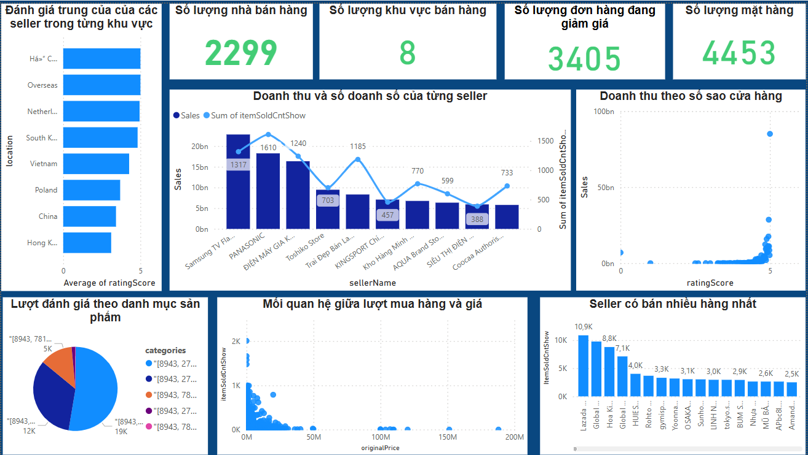

# Phân tích dữ liệu các mặt hàng trên sàn thương mại điện tử LAZADA
## Giới thiệu dự án 
- Dự án nhằm thu thập dữ liệu các sản phẩm đang hiển thị trên sàn thương mại điện tử Lazada, sau đó phân tích và trực quan hóa để tìm ra các xu hướng mua sắm, nhóm sản phẩm bán chạy, mức giá tối ưu và những yếu tố ảnh hưởng đến doanh số.

## Mục tiêu
- Thu thập dữ liệu sản phẩm theo từ khóa và lưu trữ [link](Lazada/src/crawl_to_HDFS.py)
- Phân tích mối quan hệ giữa giá sản phẩm, đánh giá và lượt mua
- Tìm ra các mặt hàng phổ biến
- Tìm ra khoảng giá phù hợp
- Đưa ra đề xuất hỗ trợ quyết định kinh doanh
- Dự đoán sản phẩm bán ra
## Dữ liệu
- Sử dụng Selenium, requests, beatifulsoup để thu thập dữ liệu từ [_LAZADA_](https://www.lazada.vn/)
- Số lượng sản phẩm: ~5.000+
- Số Danh mục sản phẩm: ALL
- Các trường dữ liệu:
  - Tên sản phẩm
  - Giá bán Orginal price
  - Giá bán Show
  - Số lượt mua hàng ItemSoldCntShow
  - Số lượt đánh giá review
  - Số sao ratting_score
  - Tên seller
  - brand
  - Location
  - ....

## Công cụ & Công nghệ & Lưu trữ
  - ***Python***: (Selenium, Requests, Pandas, Matplotlib, Seaborn, Pytorch , PySpark)
  - ***Power BI***
  - ***Jupyter notbook***
  - ***Hadoop***
  - ***MongoDB***

## Quy trình
- **Thu thập dữ liệu:**
-  Crawl dữ liệu từ các trang kết quả tìm kiếm trên Lazada theo từ khóa ( keywords )
- ***Lưu trữ***
-  Sau khi crawl data về thì lưu xuống HDFS
- **Làm sạch dữ liệu:**
  - Lấy dữ liệu từ HDFS và sử dụng pyspark   
     - Loại bỏ dữ liệu trùng lặp, dữ liệu thiếu
     - Tách dữ liệu   
     - Chuẩn hóa trường giá về dạng số
  - Lưu xuống mongodb
- **Phân tích dữ liệu:**  
  - Thống kê giá trung bình, số lượt mua trung bình  
  - Xác định top 10 sản phẩm bán chạy nhất và được đánh giá cao nhất  
  - Phân tích mối quan hệ giữa giá, rating và doanh số  
- **Trực quan hóa:**  
  - Biểu đồ cột: Top sản phẩm bán chạy  
  - Biểu đồ phân tán (scatter plot): Mối quan hệ giữa giá và số lượt mua  
  - Heatmap: Phân bổ mức giá theo từng danh mục
    
  

## Kết quả đạt được
- Mức giá lý tưởng cho sản phẩm bán chạy: từ **150.000 – 300.000 VNĐ**  
- Sản phẩm có rating trên **4 sao** có tỷ lệ mua tăng trung bình cao 
- Official stores đạt doanh số và tỷ lệ mua lại cao hơn 40% so với shop thường
## Đề xuất kinh doanh
- Tập trung quảng bá sản phẩm trong khung giá từ 150k – 300k  
- Khuyến khích khách hàng để lại đánh giá sau khi mua hàng  
- Ưu tiên hợp tác với các cửa hàng chính hãng  
